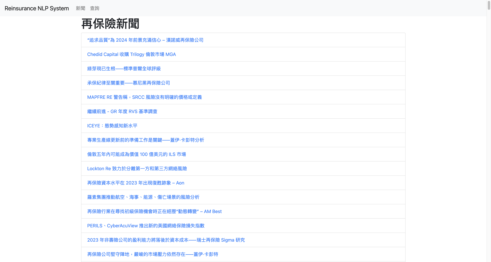
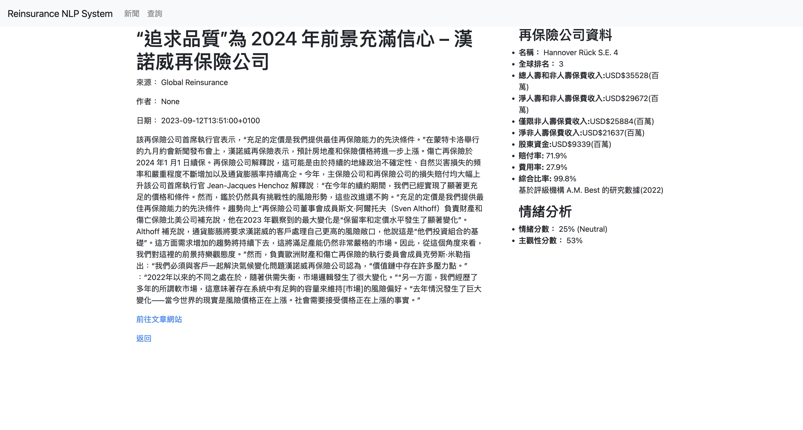
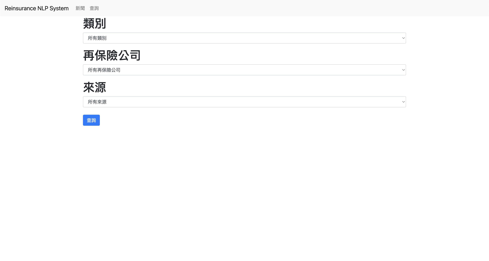
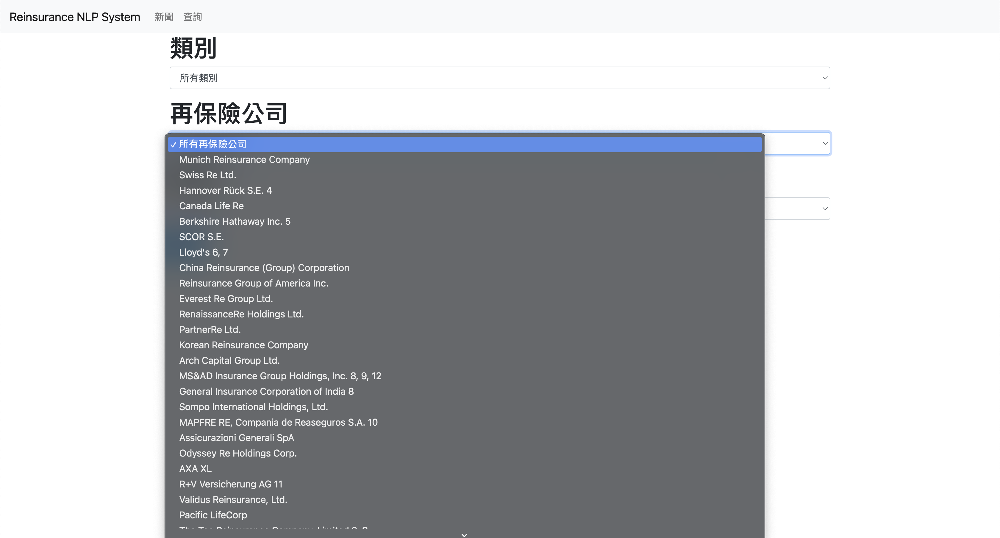

# reinsurance-NLP-system

NPL analysis system for international reinsurance news. This system will collect and process news data, provide translations, and offer user-friendly access.

## Table of Contents

- [Project Description](#project-description)
- [Screenshots](#screenshots)
- [Demo](#demo)
- [Requirements](#requirements)

## Project Description

Demo: [Demo](#demo)

Python application built using the Flask web framework. It functions as a reinsurance news data scraper and inquiry tool, incorporating natural language processing (NLP) to extract sentiment and subjectivity scores from news articles. The application also allows users to sort news articles by categories, reinsurer, and news source.

### Features

1. **Web Framework (Flask)**:
   - Utilizes the Flask web framework to create a user-friendly web application for accessing reinsurance news data.

2. **Database Connection**:
   - Establishes a connection to a MySQL database to fetch all the data.

3. **News Listing**:
   - '/news' route displays a list of news articles.
   - Users can optionally filter articles by specifying a 'category.'
   - Articles are fetched from the database based on the selected category and displayed using the 'news.html' template.

4. **Article Details**:
   - '/article/<int:article_id>' route shows detailed information about a specific news article identified by its 'article_id.'
   - Retrieves information about associated reinsurers, sentiment analysis scores, and the translated article's title and content from the database.
   - Conducts sentiment analysis and classifies sentiment as Positive, Negative, or Neutral.
   - Renders article details using the 'article.html' template.

5. **Search Functionality**:
   - '/search' route provides a search interface for filtering news articles based on criteria such as category, reinsurer, and source.
   - Processes search parameters submitted via a form (POST request).
   - Constructs SQL queries based on selected search parameters and retrieves matching articles from the database.
   - Displays search results using the 'search_results.html' template.
   - Fetches and displays available categories and reinsurers for filtering.

6. **Database Queries**:
   - Executes SQL queries to retrieve data from the database, including article details, category information, reinsurer data, sentiment scores, and search results.

7. **Bootstrap Integration**:
   - Integrates the Flask-Bootstrap extension to enhance the visual appearance and styling of web pages.

## Screenshots

Article list:

Article information, with the reinsurer data and sentiment analysis:

Search menu:

Dropdown list of reinsurers in the search menu:

## Demo 

Link to demo: [Demo](http://danielgallardo.pythonanywhere.com/news)

## Requirements

- Python3.10
- Flask
- mysql-connector-python
- Flask-Bootstrap
- Waitress
- beautifulsoup
- spacy
- spacytextblob
- fuzzywuzzy
- googletrans
